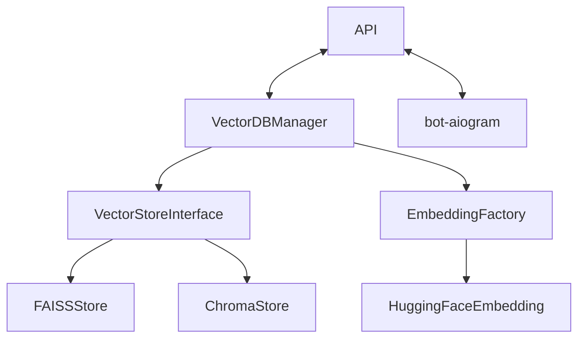

# SERVICES:
`config/` содержит 
- `settings.py` - файл конфигурации 
- `prompts.py` - файл для различных промптов под разные задачи

`api/` содержит различные версии api

`logs/` - логи, 
- `log_config.json` - файл конфигурации логов

`services/` - сервисы приложения, 
- `vectordb/` - сервис работы с векторной базой данных, содержит: 
  - `manager.py` - менеджер по работе с векторной базой данных
  - `embeddings.py` - файл реализации эмбеддингов
  - `vector_stores/` - модуль с реализациями векторных хранилищ

- `bot.py` - сервис для обработки собщений от пользователя

`utils/` - различные утилиты 
- `decorators.py` - различные декораторы
- `docs_loader.py` - файл для разбиения документов на чанки
- `session_manager.py` - менеджер по работе с http сессией

`main.py` запуск векторной бд и api для работы с ним

`docs/` хранилище обрабатываемых документов

Схема работы сервисов

## `BOT`
Обработка пользовательских запросов, запросы отправляются к сервису векторной базы данных, получают необходимую 
информацию для контекста и передает ее в модель, получает ответ и отправляет его пользователю

## `VECTORDB`
БД может запускаться как на faiss, так и на chroma, при первом запуске данные из документов в папке docs чанкуются
и векторизируются закидываются в базу данных

У сервиса есть API для по которому можно получать данные по запросу 

# TODO:
- реализовать очередь для запросов
- реализовать возможность добавления документов в базу данных
- автоматическое определение типа чанкования

1. Скармиливать ответ в ллм после того, как нашли. Чтобы ответ был более нативным, уважительным, персонализированным.

2. добавить логирование (можно langsmith) там до 5000 заросов в мес вроде бесплатно. Чтобы мы могли просматривать логироване из лк лангсмита. + можно кастомное логирование проводить в будущем. 
3. чанксайз, вероятно большеват, но надо тестировать на конкретноых документах
4. в доку дописать, расширить про каждый модуль, что есть что. + дописать команды по запуску и остановке и перезапуску контейнеров. Лучше сделать makefile, чтобы на будущее, при увеличении контейнеров и т д, мы все запускали в один клик. 
5. подумать над хранилищем документов (где потом будем хранить все доки)
6. посмотреть в сторону формирование эмбеддингов и реранжирования на модели 
Для формирования эмбеддингов: intfloat/multilingual-e5-large
Для реранжирования: BAAI/bge-reranker-v2-m3

Би-энкодеры нужны чтобы по тексту сформировать вектор. Затем эти вектора крайне быстро можно искать с помощью косинусного расстояния, например. Здесь важно что сравниваются уже не сами тексты, а некоторая функция от них, поэтому теряется часть информации. А вот кросс-энкодеры сразу сравнивают релевантность двух текстов, поэтому работают лучше, но по всей базе прогонять это намного дольше. Поэтому сначала отбирают не супер много кандидатов, а потом реранжируют

может прибавить точности гибридный поиск: сочетание индекса от энкодера и BM25. Его можно реализовать самостоятельно (объединяя поиски через langchain.EnsembleRetriever), а можно воспользоваться встроенным поиском специальных баз типа weaviate, milvus, qdrant.

для запуска выполняем команду 

    docker compose up --build
