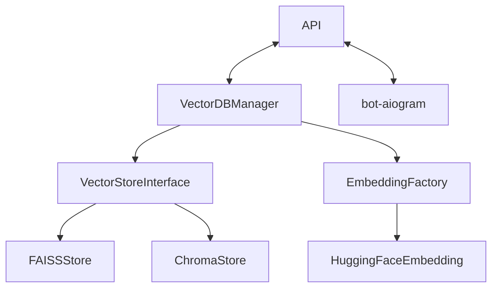

Схема работы сервиса

```mermaid
graph TD
    B[VectorDBManager]
    B --> C[VectorStoreInterface]
    C --> D[FAISSStore]
    C --> E[ChromaStore]
    B --> F[EmbeddingFactory]
    F --> G[HuggingFaceEmbedding]
    
    a[API] <--> B
    
    a <--> b[bot-aiogram]
```

для запуска выполняем команду 

    docker compose up --build
